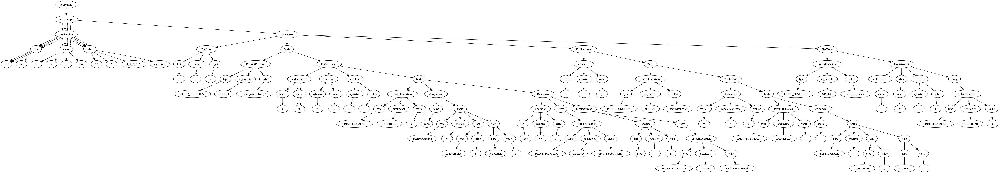

# G-Script Compiler  

## Introduction  
G-Script is a mini programming language designed to combine the simplicity of Python with the performance efficiency of C++. This project was developed as part of a compiler design course, focusing on constructing a fully functional compiler for G-Script.  

The compiler includes:  
- Grammar design  
- Lexical analysis  
- Parsing  
- Error detection  
- Visualization features  
- Handling advanced functionalities such as nested scopes  

## Features  

### 1. Grammar  
- Readable Python-like syntax  
- C++-style structures  
- Supports variable declarations, control flow statements (`if`, `while`, `for`), functions, and nested scopes  

### 2. Lexical Analyzer  
- Identifies tokens such as identifiers, keywords, operators, literals, and delimiters  
- Detects invalid tokens  

### 3. Parser  
- Uses a **top-down recursive descent parser**  
- Constructs a **parse tree**  
- Supports:  
  - Nested scopes  
  - Complex expressions  
  - Function calls and declarations  

### 4. Error Detection  
- **Lexical Errors**: Detects unrecognized characters or malformed tokens  
- **Syntax Errors**: Identifies incorrect syntax based on grammar rules  
- **Semantic Errors**: Catches undeclared variables, type mismatches, and invalid scope usage  

### 5. Visualization  
- **Parse Tree**: Uses Graphviz to represent the parse tree visually  
- **Token List**: Generates a detailed list of tokens for each program  

### 6. Performance Calculation  
- Measures execution times for each phase of the compiler (lexical analysis, parsing, etc.)  

### 7. GUI  
- A user-friendly **Graphical Interface** allows users to write, compile, and visualize G-Script programs  

### 8. File Reporting  
- Outputs the compilation process in a text file for detailed review  

---

## Installation & Setup  

### **Terminal Version**  
1. Open the `G-Script_Program` folder in your code editor  
2. Write the G-Script code in `code_test.txt` (you can use samples from `code_sample.txt`)  
3. Run `Main_Terminal_Version.py`  
4. The output will be displayed in the terminal (without visualization)  

### **GUI-Visualization Version**  
1. Open the `G-Script_Program` folder in your code editor  
2. Write the G-Script code in `code_test.txt` (you can use samples from `code_sample.txt`)  
3. Install **Graphviz** for parse tree visualization  
4. Add **Graphviz** to the Windows environment path  
5. Install required Python modules:  
   ```sh
   pip install tkinter graphviz matplotlib
   ```  
6. Run `Main_GUI-Visualization_Version.py`  
7. Select a file to compile (`code_test.txt` or any file from `Code_To_Test` folder)  
8. Click **Compile** to visualize the results  
9. Save the report file if needed  

---

## Sample Code  

### **1. Print Statements**  
```cpp
int x = 100;
print("Hello, World!");
print(100);
print(x);
print(5 + (2 * 10));
```

### **2. Variable & Array Declarations**  
```cpp
int x = 10;
str y = "Hello, World!";
int z;
arr values = [1, 2, 3, 4];
```

### **3. Loops & Conditionals**  
#### **For Loop**  
```cpp
for ( i = 0 :: < 5 :: + 1) { 
  print(i);
}
```
#### **If-Else Statements**  
```cpp
int x = 10;
if (x > 15) { 
  print("x is greater than 15"); 
} elif (x < 15) { 
  print("x is smaller than 15"); 
} else { 
  x = x ** 2; 
}
```

---

## Example: Parsing a Nested Scope  
### **Input Code**
```cpp
int x = 10;
int y = 5;
arr z = [1, 2, 3, 4, 5];
int mod;

if (x > y) { 
    print("x is greater than y");
    for ( i = 0 :: < 5 :: + 1) { 
        print(i);
        mod = i % 2;
        if (mod == 0) { 
            print("Even number found");
        } elif (mod == 1) { 
            print("Odd number found");
        }
    }
}
```

---

## Parse Tree Example 



---

## Future Improvements  
- **Performance Optimization**  
- **Extending Language Features**  
- **Adding Runtime Support**  

Enjoy G-Script! 🚀  

---
